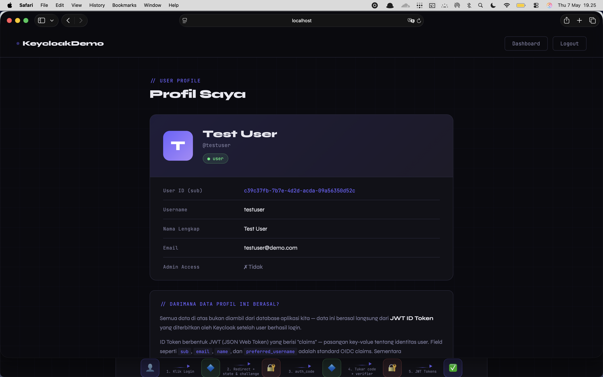
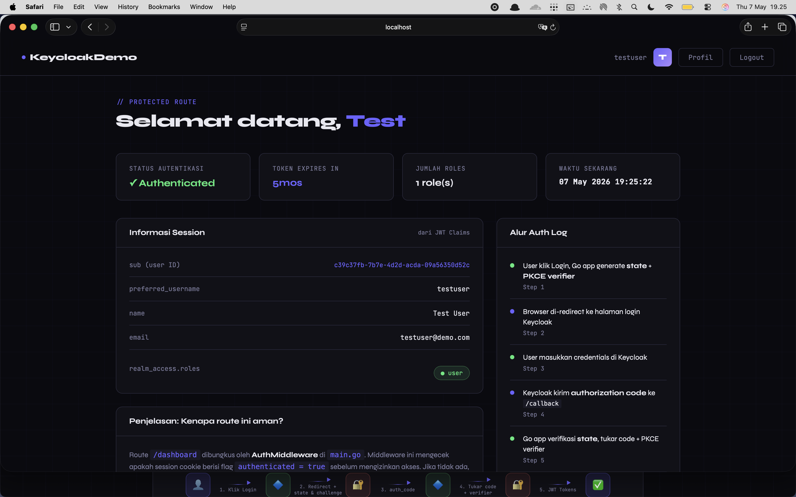
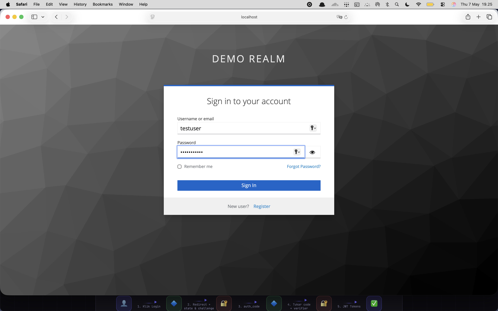
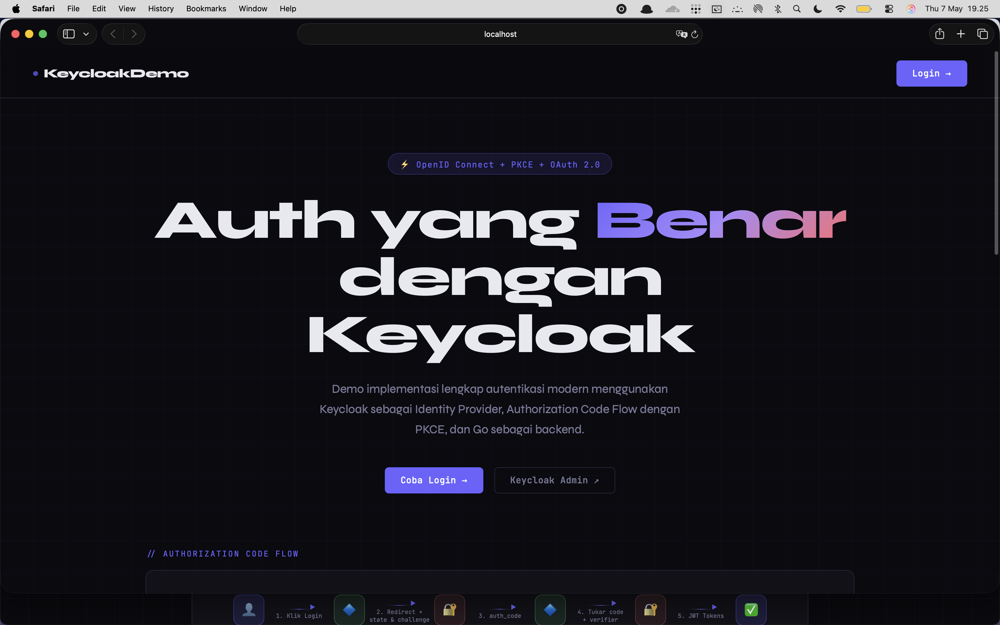

# Keycloak + Go Demo — Panduan Lengkap

Implementasi autentikasi modern menggunakan Keycloak sebagai Identity Provider
dan Go sebagai client, dengan Authorization Code Flow + PKCE.

## Previews

<div align="center">
  
  
  
  
</div>

## Prasyarat

- Docker & Docker Compose
- Go 1.22+

## Cara Menjalankan

### 1. Jalankan Keycloak

```bash
# Dari root folder project
docker compose up -d

# Pantau sampai Keycloak siap (lihat log)
docker compose logs -f keycloak
# Tunggu pesan: "Keycloak 24.x.x on JVM ... started in ..."
```

Keycloak akan otomatis mengimport `realm-export.json` sehingga
realm `demo-realm`, client `go-demo-app`, dan user demo sudah tersedia.

### 2. Jalankan Go App

```bash
cd go-app

# Download dependencies
go mod tidy && go mod download

# Jalankan
go run main.go
```

Buka http://localhost:9090

### 3. Coba Login

| Username   | Password    | Roles        |
|------------|-------------|--------------|
| testuser   | password123 | user         |
| adminuser  | admin123    | user, admin  |

---

## Struktur Project

```
keycloak-go-demo/
├── compose.yml                 # Keycloak + PostgreSQL
├── keycloak/
│   └── realm-export.json       # Konfigurasi realm (auto-import)
├── go-app/
│   ├── main.go                 # Entry point, setup OIDC, routes
│   ├── handlers/
│   │   ├── auth.go             # Login, Callback, Logout
│   │   └── home.go             # Home, Dashboard, Profile
│   ├── middleware/
│   │   └── auth.go             # AuthMiddleware (protected routes)
│   ├── templates/
│   │   ├── home.html           # Landing page
│   │   ├── dashboard.html      # Protected page
│   │   └── profile.html        # User profile
│   └── go.mod
└── Makefile
```

---

## Alur Autentikasi (Authorization Code Flow + PKCE)

```
User          Go App (:9090)        Keycloak (:8080)
 │                 │                      │
 │  GET /login     │                      │
 │────────────────>│                      │
 │                 │ generate state+PKCE  │
 │                 │                      │
 │  302 Redirect   │                      │
 │<────────────────│                      │
 │                                        │
 │  GET /auth?code_challenge=...          │
 │───────────────────────────────────────>│
 │                                        │
 │  Login Form                            │
 │<───────────────────────────────────────│
 │                                        │
 │  Submit credentials                    │
 │───────────────────────────────────────>│
 │                                        │
 │  302 /callback?code=AUTH_CODE          │
 │<───────────────────────────────────────│
 │                 │                      │
 │  GET /callback  │                      │
 │────────────────>│                      │
 │                 │  POST /token         │
 │                 │  (code + verifier)   │
 │                 │─────────────────────>│
 │                 │                      │
 │                 │  { access_token,     │
 │                 │    id_token,         │
 │                 │    refresh_token }   │
 │                 │<─────────────────────│
 │                 │                      │
 │                 │ verify ID Token sig  │
 │                 │ parse JWT claims     │
 │                 │ save to session      │
 │  302 /dashboard │                      │
 │<────────────────│                      │
```

---

## Environment Variables

| Variable        | Default                              | Keterangan               |
|----------------|--------------------------------------|--------------------------|
| KEYCLOAK_URL   | http://localhost:8080                | URL Keycloak             |
| KEYCLOAK_REALM | demo-realm                           | Nama realm               |
| CLIENT_ID      | go-demo-app                          | Client ID                |
| CLIENT_SECRET  | my-super-secret-client-secret        | Client secret            |
| REDIRECT_URL   | http://localhost:9090/callback       | Callback URL             |
| APP_PORT       | 9090                                 | Port Go app              |
| SESSION_KEY    | super-secret-session-key-32chars     | Key enkripsi session     |

---

## Produksi: Hal yang Harus Diubah

1. **Gunakan HTTPS** — ganti `start-dev` ke `start` di docker-compose,
   konfigurasikan TLS certificate.

2. **Secrets yang kuat** — ganti semua password dan session key dengan
   secrets yang di-generate secara random dan disimpan di vault/secret manager.

3. **`KC_HOSTNAME_STRICT: true`** — aktifkan strict hostname checking.

4. **Refresh Token** — implementasikan logika refresh token agar user
   tidak perlu login ulang saat access token expire.

5. **HTTPS-only cookies** — set `Secure: true` di session options.

6. **Rate limiting** — tambahkan rate limiting di endpoint `/login` dan `/callback`.

### Apa itu Keycloak?

Keycloak adalah **Identity and Access Management (IAM)** open-source dari Red Hat. Fungsinya adalah menjadi "penjaga gerbang" terpusat untuk autentikasi dan otorisasi. Daripada setiap aplikasi mengelola login/password sendiri, semua didelegasikan ke Keycloak.

Bayangkan Keycloak seperti **security guard** di gedung perkantoran — semua tamu harus lapor ke security dulu, dapat badge, dan baru bisa masuk ke ruangan manapun.

### Protokol yang Dipakai: OpenID Connect (OIDC)

Keycloak mengimplementasikan **OAuth 2.0** dan **OpenID Connect (OIDC)**. Ini penting dipahami:

**OAuth 2.0** = protokol untuk *authorization* (memberi izin akses). **OIDC** = lapisan di atas OAuth 2.0 untuk *authentication* (membuktikan identitas siapa kamu).

Flow yang kita pakai namanya **Authorization Code Flow**, yang bekerja seperti ini:

```
User → App → Keycloak (login) → App dapat "code" →
App tukar "code" dengan "token" → App dapat akses
```

### Konsep Token

Keycloak mengeluarkan tiga jenis token berbentuk **JWT (JSON Web Token)**:

**Access Token** — bukti bahwa user sudah login, dikirim ke API untuk otorisasi. Umurnya pendek (biasanya 5 menit). **Refresh Token** — dipakai untuk minta Access Token baru tanpa login ulang. Umurnya lebih panjang. **ID Token** — berisi informasi profil user (nama, email, dll).

### Konsep Realm, Client, dan User di Keycloak

**Realm** adalah "namespace" atau "tenant" — seperti sebuah organisasi yang punya user, client, dan konfigurasi sendiri. **Client** adalah aplikasi yang terdaftar di Keycloak (contoh: aplikasi Go kita). **User** adalah pengguna akhir yang bisa login.

### Bagian 1: Docker Compose — Kenapa PostgreSQL?

Di `docker-compose.yml`, kita pakai PostgreSQL bukan database bawaan Keycloak (H2). Alasannya penting: H2 adalah embedded database yang hanya hidup di memori — jika container restart, **semua data hilang**. PostgreSQL menyimpan data di volume Docker yang persisten.

Hal penting lainnya di docker-compose adalah `depends_on` dengan `condition: service_healthy`. Ini memastikan Keycloak tidak mencoba konek ke database sebelum PostgreSQL benar-benar siap menerima koneksi — bukan sekadar "container sudah jalan."

### Bagian 2: realm-export.json — Infrastruktur sebagai Kode

File ini adalah jantung dari konfigurasi Keycloak kita. Daripada mengklik-klik di Admin UI setiap kali setup ulang, semua konfigurasi tersimpan sebagai JSON yang bisa di-version control.

Yang paling penting dipahami di sini adalah konfigurasi **Client**. Kita set `standardFlowEnabled: true` (mengaktifkan Authorization Code Flow) dan `publicClient: false` (artinya client kita punya secret — ini disebut "confidential client"). Kita juga set `pkce.code.challenge.method: S256` untuk memaksa PKCE.

`redirectUris` adalah allowlist URL yang boleh menerima authorization code dari Keycloak. Ini adalah security measure penting — Keycloak tidak akan mengirim code ke URL sembarangan.

### Bagian 3: main.go — Inisialisasi OIDC

Di sinilah sihir dimulai. Baris `gooidc.NewProvider(ctx, issuerURL)` melakukan HTTP GET ke endpoint discovery Keycloak:

```
http://localhost:8080/realms/demo-realm/.well-known/openid-configuration
```

Endpoint ini mengembalikan JSON yang berisi semua URL penting: `authorization_endpoint`, `token_endpoint`, `jwks_uri` (untuk verifikasi signature JWT), dll. Library `go-oidc` mengambil semua ini otomatis, sehingga kita tidak perlu hardcode URL-URL tersebut.

**Kenapa session disimpan server-side?** Kita menyimpan token di gorilla/sessions dengan cookie terenkripsi, bukan di localStorage browser. Ini penting karena localStorage bisa diakses oleh JavaScript — rentan terhadap serangan XSS. Cookie dengan flag `HttpOnly: true` tidak bisa diakses sama sekali oleh JavaScript.

### Bagian 4: handlers/auth.go — Alur Login yang Aman

Fungsi `Login` melakukan dua hal kritis sebelum redirect ke Keycloak:

**State token untuk CSRF** adalah string random 32 karakter yang disimpan di session. Setelah user login dan Keycloak mengirim callback, kita verifikasi bahwa state yang dikirim Keycloak sama persis dengan yang kita simpan. Ini mencegah skenario di mana attacker menipu browser kamu untuk mengirim request login ke aplikasi kita.

**PKCE (Proof Key for Code Exchange)** adalah proteksi berlapis. Kita generate `code_verifier` (string random 64 karakter), lalu kita hash SHA-256 untuk mendapatkan `code_challenge`. Challenge-nya kita kirim ke Keycloak. Saat tukar token, kita kirim `code_verifier` asli — Keycloak memverifikasi bahwa `SHA256(code_verifier) == code_challenge`. Ini mencegah serangan di mana seseorang berhasil mencuri authorization code di tengah jalan tapi tidak bisa menukarnya dengan token karena tidak punya verifier aslinya.

Di fungsi `Callback`, setelah tukar token, kita **wajib** memverifikasi signature ID Token:

```go
idToken, err := h.Verifier.Verify(ctx, rawIDToken)
```

Verifikasi ini menggunakan public key Keycloak (diambil dari `jwks_uri`) untuk memastikan token tidak dipalsukan. Tanpa langkah ini, aplikasi bisa ditipu dengan token JWT yang dibuat sendiri.

### Bagian 5: middleware/auth.go — Route Protection

Middleware pattern di Go sangat elegan. Middleware `Require` menerima `http.Handler` dan mengembalikan `http.Handler` baru yang "membungkus" handler asli:

```go
mux.Handle("/dashboard", authMiddleware.Require(http.HandlerFunc(homeHandler.Dashboard)))
```

Sebelum `homeHandler.Dashboard` dipanggil, middleware mengecek session. Jika `authenticated != true`, user langsung di-redirect ke `/login`. Handler asli tidak pernah dieksekusi. Ini adalah cara Go idiomatik untuk middleware tanpa framework tambahan.

### Bagian 6: RBAC (Role-Based Access Control)

Keycloak menyimpan realm roles di **Access Token**, bukan ID Token. Di `parseAccessTokenClaims`, kita decode Access Token (yang juga JWT) untuk membaca bagian `realm_access.roles`. Kita tidak perlu memverifikasi signature Access Token di sini karena kita baru saja mendapatkannya langsung dari Keycloak — tidak ada risiko pemalsuan dalam transit ini.

Roles ini kemudian dikirim ke template HTML sebagai `IsAdmin`, dan template menggunakannya untuk menampilkan/menyembunyikan section tertentu (`{{if .IsAdmin}}`).

---

## Apa yang Bisa Dikembangkan Selanjutnya?

Dua hal yang paling penting untuk ditambahkan di tahap berikutnya adalah **token introspection** jika Go app perlu memvalidasi token yang dikirim oleh service lain, dan integrasi dengan **resource server** — yaitu membuat API endpoint yang menerima Bearer token di Authorization header untuk arsitektur microservices.
